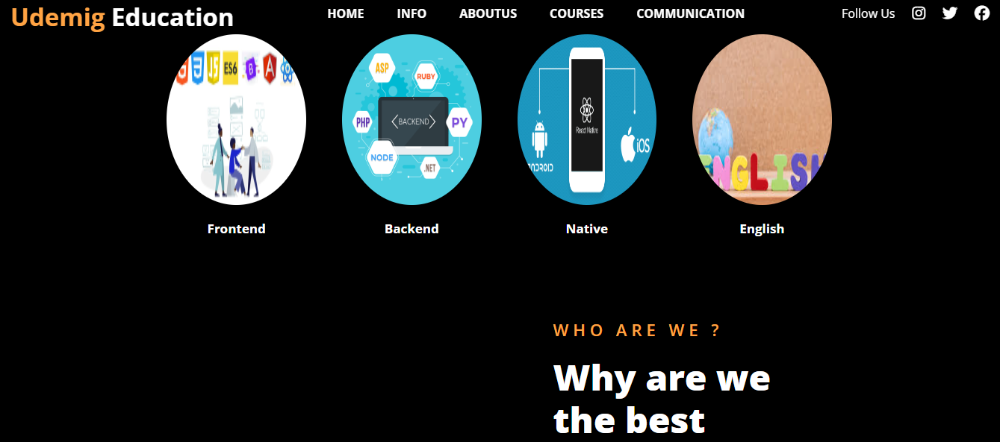
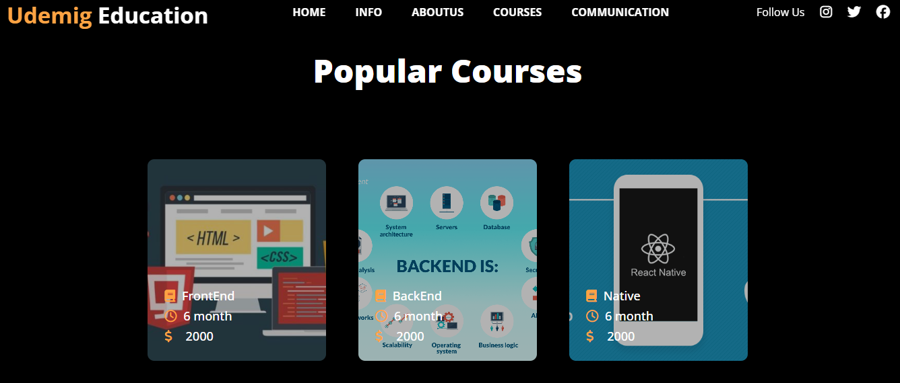
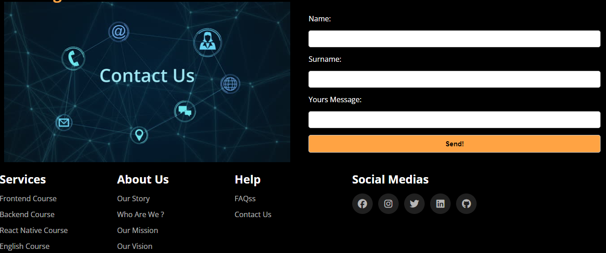

# UdemigEduPro WEb Site

- This repo contains the source codes of a fully responsive website of Udemic Software academia . The website was built using HTML and SCSS and was designed using a modular SCSS architecture and variables to facilitate maintenance and reuse. The design includes a header area,main area,educations area,aboutUs area,contact area,top educations which are mostly prefer and footer area.

# General proporties

- Responsive Design: The website is fully responsive and adapts perfectly to different screen sizes and devices.

- Modular SCSS: SCSS files are organized in a modular structure for easy maintenance and scalability. SCSS variables are used to ensure consistency of style elements such as colors and font sizes.

- User-Friendly Interface: Users can easily get information about academia
and They can easily ask all the questions they have in mind.

# Video GIF

# ScreenShots

